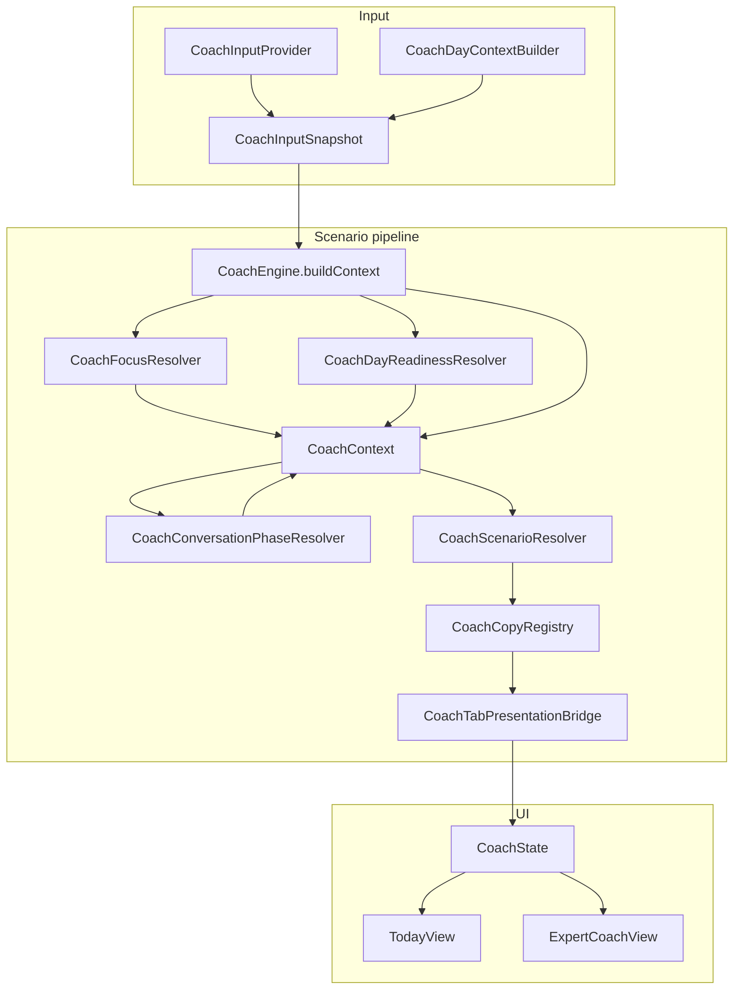

# Coach Context Layer Audit

> PR2 audit after PR1 consolidated `CoachUIPresentation`.  
> Goal: document ownership, map duplication, enable safe PR3 consolidation.

## Current data flow (production)



**Entry:** `CoachState.ready` → `CoachEngine.evaluate` → `CoachTabPresentationBridge.build`

---

## Context types — responsibilities

### `CoachFocusResolver` / `CoachFocusSelection`
| | |
|--|--|
| **Creates** | `CoachEngine.buildContext` |
| **Consumers** | `CoachEngine`, `MealsView` (meal timing), tests |
| **Owns** | Which activity is in focus; `CoachActivityState`, `CoachSessionPhase`, `CoachFocusSource`; live detection via `CoachSessionPhaseStability` |
| **Routing** | **Yes** — all focus-derived fields feed `CoachContext` → `CoachScenarioResolver` |
| **Presentation** | Indirect via scenario/copy |
| **File** | `Context/CoachFocusSelection.swift` |

Priority chain: explicit focus → live session → serious upcoming → recent completed serious → any upcoming → recent non-serious → idle.

Key windows:
- Immediate post: 60 min → `.justFinished`
- Recent completed: 180 min (45 min for heat via `CoachHeatRecoveryPolicy`)

---

### `CoachContext`
| | |
|--|--|
| **Creates** | `CoachEngine.buildContext` + `finalizeContext` |
| **Consumers** | `CoachScenarioResolver`, `CoachCopyRegistry`, `CoachPresentationResolver`, `CoachTabPresentationBridge`, walk copy helpers |
| **Owns** | Facts-only snapshot: taxonomy, session phase, day load, nutrition signals, readiness, tomorrow demand |
| **Routing** | **Yes** — primary input to scenario resolver |
| **Presentation** | Indirect; fuel/hydration → modifiers + safety alerts + Why rows only |
| **File** | `Context/CoachContext.swift` |

Engine overrides focus into `.tomorrowProtection` session phase when heavy day + tomorrow demand + no upcoming work today (`CoachUpcomingActivityPolicy` gate).

`conversationPhase` — presentation frame only; must not appear in `CoachScenarioResolver` switches (see `CoachConversationPhaseSafetyContract.md`).

---

### `CoachDayContext`
| | |
|--|--|
| **Creates** | `CoachDayContextBuilder.build`; embedded in `CoachInputSnapshot` |
| **Consumers** | `CoachFocusResolver` (`lastCompletedActivity`), `CoachTomorrowDemandResolver`, `CoachEngine` (day load volume), `MealsView`, logging |
| **Owns** | Day-level aggregates: activity lists, volume minutes, tomorrow stress |
| **Routing** | Indirect only |
| **Presentation** | Meals recommendations |
| **File** | `Context/CoachDayContext.swift` |

Many stored fields are pre-computed but not yet read — candidates for PR3 trim (see Duplication map).

---

### `CoachDayActivityContext` — retired (PR3 Phase C)
Removed test-only UI phase stack. Prep/recovery window values live in `CoachActivityWindowPolicy`.
Production focus remains `CoachFocusResolver` → `CoachContext`.

---

### Related policies (single-purpose)

| Type | Routing | Presentation | File |
|------|---------|--------------|------|
| `CoachActivityWindowPolicy` | Focus + scenario time windows | None | `CoachActivityWindowPolicy.swift` |
| `CoachConversationNutritionPolicy` | None | Suppresses fuel/hydration in opening/closing | `CoachConversationNutritionPolicy.swift` |
| `CoachDayClosingPolicy` | None | Evening wind-down nutrition suppression | `CoachDayClosingPolicy.swift` |
| `CoachDayClosingCopyPolicy` | None | Evening wind-down copy overlay | `CoachDayClosingCopyPolicy.swift` |
| `CoachDayReadinessResolver` + `CoachDayReadinessRouter` | Idle + pre-session scenarios | Via scenario | `CoachDayReadiness.swift` |
| `CoachUpcomingActivityPolicy` | Gates tomorrow protection override | Indirect | `CoachUpcomingActivityPolicy.swift` |
| `CoachMorningOverviewPolicy` | None | Suppresses fuel/hydration modifiers in morning | `CoachMorningOverviewPolicy.swift` |
| `CoachStableDayProfile` | None | stableDay sub-variant copy/icon | `CoachStableDayProfile.swift` |
| `CoachAthleteStateResolver` | None | Body-state copy tone | `CoachAthleteStateResolver.swift` |
| `CoachHeatRecoveryPolicy` | Heat recovery window (45 min) | Indirect | `CoachHeatRecoveryPolicy.swift` |
| `CoachSessionPhaseStability` | Via focus → session phase | None | `CoachSessionPhaseStability.swift` |
| `CoachStackedDayRisk` | None (modifier) | Critical Today chrome | `CoachStackedDayRisk.swift` |
| `CoachConversationPhaseResolver` | None | Nutrition suppression, morning Why | `CoachConversationPhaseResolver.swift` |

---

## Duplication map

### 1. Activity phase (2 production models + walk copy sub-phase)

| Model | Location | Production? |
|-------|----------|-------------|
| `CoachSessionPhase` (pre/during/immediatePost/…) | `CoachContext.swift` | **Yes** |
| Walk copy `Phase` (upcoming/live/completed) | `CoachWalkRecoveryActionCopy.swift` | **Yes** (presentation sub-phase) |

~~`CoachActivityPhase` / `CoachActiveSessionPhase`~~ — retired PR3 Phase C.

### 2. Focus selection (single stack)

| Stack | Logic |
|-------|-------|
| `CoachFocusResolver` | Live → serious upcoming → recent completed → any upcoming → idle |

Prep windows preserved in `CoachActivityWindowPolicy` for future Today UI (Phase D).

### 3. Post-activity windows

| Source | Window |
|--------|--------|
| `CoachFocusResolver.immediatePostWindowMinutes` | 60 min → `CoachActivityWindowPolicy` |
| `CoachFocusResolver` recent completed | 180 min (45 heat) → `CoachActivityWindowPolicy` |
| `CoachActivityWindowPolicy.recoveryHoldMinutes` | 8–120 by kind/load (future Today UI) |
| `CoachScenarioResolver` heat | 45 min → `CoachActivityWindowPolicy.isWithinHeatRecoveryWindow` |

### 4. Tomorrow protection (3 paths)

| Mechanism | Scenario |
|-----------|----------|
| Engine → `sessionPhase.tomorrowProtection` | `.tomorrowProtection` |
| `CoachDayReadinessRouter` morning idle | `.protectTomorrowFresh` |
| `CoachStableDayProfile.tomorrowReserve` | Copy variant of `.stableDay` only |

Shared gate: `CoachUpcomingActivityPolicy.hasMeaningfulActivityLaterToday`.

### 5. Activity taxonomy (2 classifiers)

| | `CoachActivityClassifier` | `CoachActivityContextResolver` |
|--|---------------------------|--------------------------------|
| Enums | `CoachActivityFamily` / `CoachActivityType` | `CoachActivityKind` / `CoachActivityLoad` |
| Used by | Focus, scenario routing | DayContext builder, DayPriorityModel |
| Example drift | Tennis → `.racket` | Tennis → `.workout` |

### 6. Hydration / fuel

Single pipeline — does **not** change `CoachScenarioKey`:

```
CoachNutritionPace → CoachContext.fuel/hydration
  → CoachScenarioModifiers (fuelBehind/hydrationBehind)
  → CoachMorningOverviewPolicy suppresses in morningOverview
  → CoachScenarioResolver.safetyAlert (critical during .during only)
  → CoachTabPresentationBridge Why rows
```

### 7. Live session detection

| Detector | Logic |
|----------|-------|
| `CoachSessionPhaseStability.isCoachLiveSession` | `isActive` OR HK grace after planned end |

---

## PR2 safe cleanup (this PR)

Removed without behavior change:
- Unused computed properties on `CoachDayActivityContext`
- Dead wrappers: `resolve(brain:)`, `phase(...)`, `isCoachRelevant`, `CoachActivitySubtitle` pass-throughs
- Unused private helpers: `isHydrationLog`, `isNutritionPseudoActivity` in DayActivityContext
- Dead `CoachEngine.isEveningPhase` (duplicate of FocusResolver version)

Added:
- Ownership comments on context files
- `CoachContextLayerRegressionTests` locking focus → scenario chains
- This audit document

**Not changed:** scenario routing, copy output, UI, layer merges.

---

## Recommended PR3 consolidation plan

### Phase A — Trim input layer (low risk) ✅ Done
1. ~~Audit-read all `CoachDayContext` fields; remove unused stored properties from builder.~~
2. ~~Document which fields Meals vs Coach actually need.~~

**Retained fields** (10): `date`, `now`, `allActivities`, `lastCompletedActivity`, `upcomingActivities`, `completedActivityVolumeMinutes`, `upcomingTrainingActivities`, `upcomingTrainingMinutes`, `upcomingTrainingStressScore`, `hasMeaningfulLoadCompleted`.

**Removed**: `CoachDayType`, `CoachDayRisk`, and 25 unused stored properties (counts, aliases, dayType/dayRisk flags, meal/recovery breakdowns, etc.).

**Tests**: `CoachDayContextBuilderTests.swift`

### Phase B — Classifier unification (medium risk) ✅ Done
1. ~~Make `CoachActivityClassifier` the single taxonomy source~~ — `coachKind`, `coachLoad`, `activityCalories` live on classifier.
2. ~~Migrate `CoachActivityContextResolver.kind/load` callers~~ — resolver is now a thin delegate.
3. ~~Add parity tests for tennis/racket/walk edge cases~~ — `CoachActivityClassifierParityTests.swift`.

**Taxonomy split:**
- Scenario routing → `CoachActivityClassifier.type` / `family`
- Day aggregates / priority / legacy UI phase → `coachKind` / `coachLoad` bridge

**Parity fixes:** tennis/squash → `.racket` type + `.workout` kind; hot yoga → `.heat` kind; swim → `.endurance` kind without forcing activity type.

### Phase C — Retire `CoachDayActivityContext` (medium risk) ✅ Done
**Option 1 (delete):** Removed parallel test-only stack; extracted prep/recovery windows to `CoachActivityWindowPolicy`.

**Deleted:** `CoachDayActivityContext.swift`, `CoachDayActivityContextXCTests.swift`, `CoachActivityPhase`, `CoachActiveSessionPhase`, `CoachActivitySubtitle`.

**Tests:** `CoachActivityWindowPolicyTests.swift`, `CoachCanonicalDayStateTests.swift` (hydration/meal filtering preserved).

### Phase D — Window consolidation (higher risk) ✅ Done
1. ~~Consolidate post-activity windows into `CoachActivityWindowPolicy`~~ — focus (60/180/45 heat) + scenario heat gate.
2. ~~Wire Focus + Scenario resolver~~ — `CoachFocusResolver` and `CoachScenarioResolver` delegate to policy.
3. Prep/recovery hold windows remain for future Today UI; not wired to focus (by design).

### Phase E — Conversation phase completion ✅ Done
1. ~~Wire `isFirstOpenToday`~~ — `CoachSessionTracker` → resolver; gates `morningOverview` on first open.
2. ~~Wire `dayClosing`~~ — `CoachDayClosingPolicy` + `CoachConversationNutritionPolicy` suppress evening catch-up (modifiers, Why rows, alert severity).

---

## Regression test coverage (PR2)

`CoachContextLayerRegressionTests.swift` locks:

| Case | Asserts |
|------|---------|
| Active endurance | `.duringEndurance`, focus `.active`, phase `.during` |
| Post-endurance hold | `.postEnduranceImmediate` within 60 min |
| Walk after heavy load | `.walkAfterHeavyLoad`, focus `.recentCompleted` |
| Sauna recovery | `.saunaRecovery` within 45 min heat window |
| Tomorrow protection | `.tomorrowProtection` evening heavy + tomorrow demand |
| Stable day + fuel/hydration | `.stableDay` unchanged; deficits in supporting signals only |

---

## Key files

| Path | Role |
|------|------|
| `Context/CoachFocusSelection.swift` | Production focus owner |
| `Context/CoachContext.swift` | Facts + taxonomy enums |
| `Core/CoachEngine.swift` | Context assembly |
| `Context/CoachScenarioResolver.swift` | Scenario routing |
| `Context/CoachActivityWindowPolicy.swift` | Prep/recovery hold windows (Phase D input) |
| `Context/CoachDayContext.swift` | Input day aggregates |
| `Context/CoachSessionPhaseStability.swift` | HK live-session grace |
| `Docs/CoachConversationPhaseSafetyContract.md` | conversationPhase non-routing contract |
