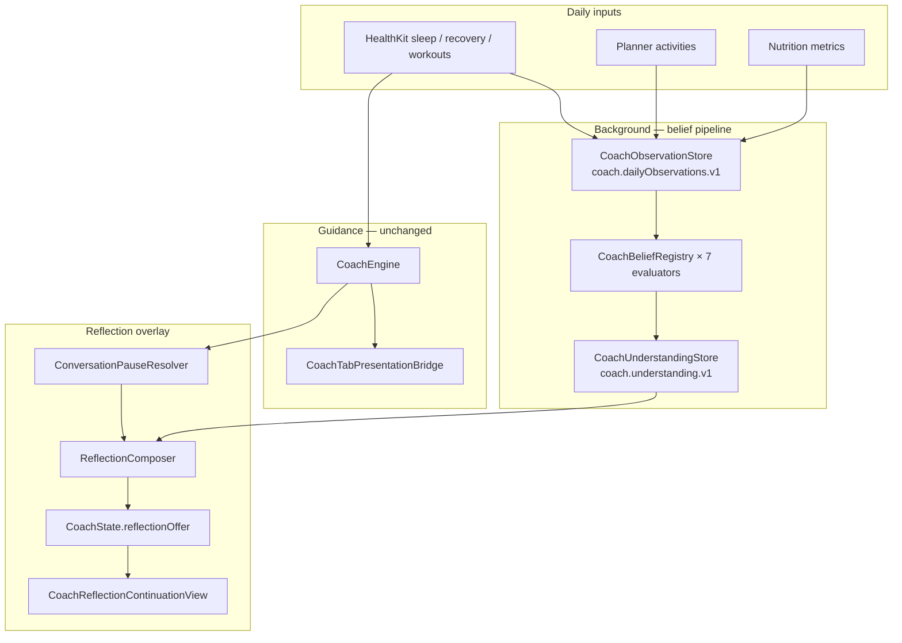

# Coach Reflection — Production Audit (Jul 2026)

> **Audience:** engineering, product, QA before App Store release  
> **Companion:** [CoachReflectionArchitectureContract.md](./CoachReflectionArchitectureContract.md)  
> **Status:** shipped in all build configurations (Jul 2026)

---

## Executive summary

Coach Reflection is a **quiet continuation** of the Coach card. After today's operational Guidance (MY READ, MY RECOMMENDATION, NEXT STEP, etc.) is finished, Coach may add one short observational paragraph when its **long-horizon understanding of the athlete has changed**.

| Layer | Status | Notes |
|-------|--------|-------|
| Observation ingestion | Implemented | 21-day window, UserDefaults persistence |
| Belief evaluation (7 beliefs) | Implemented | Sleep ×3, training load ×3, nutrition ×1 |
| Event queue + utterance ledger | Implemented | FIFO, display-gated consumption |
| Pause gate | Implemented | Read-only; Guidance owners block reflection |
| Composition + copy | Implemented | EN/RU, belief-specific utterances |
| UI continuation | Implemented | Subtle divider + lead-in + message |
| **Production path** | **Live** | Observation, compose, and render run in Release |

**Bottom line:** Reflection is live in all build configurations. Run the regression suite below before release candidates.

---

## Mental model

```
Guidance  = what matters right now   (operational, scenario-driven)
Reflection = what Coach learned over weeks   (belief change, pause-gated)
```

Reflection is **not** a scenario, Insights surface, second recommendation card, or scheduled digest. It communicates **belief change** in first-person observational tone — never prescriptions, data dumps, or dashboard language.

### Product principles

| Principle | Meaning |
|-----------|---------|
| Guidance owns the moment | Preparation, safety, recovery, tomorrow protection always win |
| Reflection owns the pause | Speaks only when today's important Coach conversation has naturally finished |
| Understanding, not time | Driven by **understanding events**, never calendar timers |

---

## End-to-end pipeline



Guidance and Reflection are **siblings**. Reflection does not alter scenario routing, focus selection, copy packs, or `CoachInputFingerprint`.

---

## Phase 1 — Observation ingestion

**When it runs:** On each Coach input refresh, inside `CoachInputProvider`.

| Step | File | Behavior |
|------|------|----------|
| Record today | `CoachObservationStore.recordToday` | Requires health access requested + `sleepMinutes > 0` |
| Backfill | `CoachUnderstandingService.refresh` | Up to 21 prior days async |
| Assemble | `CoachObservationAssembler` | Sleep, recovery, bedtime, training, nutrition per day |
| Persist | UserDefaults `coach.dailyObservations.v1` | Keyed by `YYYY-MM-DD` day key |

### Per-day evidence (`CoachDailyObservation`)

| Signal | Source | Required for |
|--------|--------|--------------|
| `sleepMinutes`, `recoveryPercent` | HealthKit | All beliefs |
| `bedStartNormalizedMinutes` | HealthKit bedtime | Sleep beliefs |
| Training fields (`workoutIntensityBand`, `hadHardTraining`, …) | Activity metrics / workouts | Training beliefs |
| Nutrition fields (`caloriesEaten`, `calorieDeficit`, …) | HealthKit or planned meals | Underfueling belief |

Days without sleep data are skipped at record time. Training and nutrition fields may be absent on older backfilled days.

---

## Phase 2 — Belief calculation

**When it runs:** After observation record/backfill, via `CoachUnderstandingService.evaluateBeliefs()`.

### Registered beliefs (evaluation order)

| # | Belief ID | Domain | What it compares | Min eligible days |
|---|-----------|--------|------------------|-------------------|
| 1 | `sleepConsistencyRecovery` | Sleep | Consistent vs inconsistent bedtime → next-day recovery | 8 sleep+recovery days |
| 2 | `sleepDurationRecovery` | Sleep | ≥7–7.5h vs shorter sleep → recovery | 8 sleep+recovery days |
| 3 | `lateBedtimeRecovery` | Sleep | Normal vs late bedtime → next-morning recovery | 8 sleep+recovery days |
| 4 | `heavyLoadRecoveryLag` | Training | Recovery lag 1–2 days after hard training | 10 training+recovery days |
| 5 | `recoveryAfterRestDay` | Training | Recovery rebound after lighter day post-heavy work | 12 training+recovery days |
| 6 | `consecutiveHardDaysFatigue` | Training | Recovery dip when hard days stack back-to-back | 14 training+recovery days |
| 7 | `underfuelingRecovery` | Nutrition | Weaker recovery after significantly underfueled days | 12 nutrition+recovery days |

### Shared thresholds (all evaluators)

| Transition | Effect-size threshold | Notes |
|------------|----------------------|-------|
| `watching` → `emerging` | ≥ **8.0** recovery points | Recovery delta, lag, drop, or rebound depending on belief |
| `emerging` → `established` | ≥ **6.0** recovery points | Requires `hasEstablishedSamples` per belief |
| `established` → `weakening` | effect < **4.0** | Insufficient samples accelerates decay |
| `weakening` → `retired` | effect < **2.0** | Terminal — cannot re-emerge |

### Maturity lifecycle

```
watching → emerging → established
              ↑           ↓
           weakening ← established
              ↓
           retired (terminal)
```

### Understanding events (upgrade only)

| Maturity change | Event `change` | `ReflectionKind` |
|-----------------|----------------|------------------|
| `watching` → `emerging` or `established` | `.emerged` | `.newDiscovery` |
| `weakening` → `emerging` | `.emerged` | `.newDiscovery` |
| `emerging` → `established` | `.strengthened` | `.confirmation` |

**Event ID format:** `{beliefID}.{change}.{maturity}` — e.g. `sleepConsistencyRecovery.emerged.emerging`

**Downgrades** update stored maturity and **clear unspoken pending events** for that belief. They never enqueue reflection.

---

## Phase 3 — Decision: when reflection may speak

`ReflectionComposer.compose` is the single eligibility entry point.

### Three-gate AND

All must be true:

1. **Conversational pause** — `ConversationPauseResolver.isPaused == true`
2. **Unspoken understanding event** — `CoachUnderstandingStore.nextUnspokenEvent() != nil`
3. **Not already spoken** — event ID ∉ `spokenEventIDs`

If any gate fails → `reflectionOffer = nil` (correct default; most visits show Guidance only).

### ConversationPauseResolver — blocker matrix

Reflection is **blocked** while any Guidance owner is active:

| Blocker | Trigger |
|---------|---------|
| `safetyAlert` | `safetyAlert != nil` OR `alertSeverity != .none` |
| `elevatedUrgency` | `urgencyLevel >= .protective` (`.live` / `.focused` do **not** block) |
| `activeWorkout` | `focusSource == .active` |
| `duringWorkout` | `sessionPhase == .during` OR `activityState == .active` |
| `immediatePostRecovery` | `sessionPhase == .immediatePost` |
| `imminentPreparation` | `sessionPhase == .pre` |
| `tomorrowProtection` | `sessionPhase == .tomorrowProtection` |
| `meaningfulWorkRemaining` | `CoachUpcomingActivityPolicy.hasMeaningfulActivityLaterToday(snapshot)` |

When unblocked, pause reason derives from `sessionPhase`:

| Session phase | Pause reason |
|---------------|--------------|
| `.settledPost` | `settledPostNoWorkRemaining` |
| `.evening` | `eveningNoWorkRemaining` |
| `.idle` | `idleNoWorkRemaining` |

**Not a clock trigger (R7):** Evening pause requires session-phase context (e.g. post-workout settled evening), not time alone.

### Event queue behavior

| Rule | Implementation |
|------|----------------|
| Serialization | FIFO — first unspoken event in `pendingEvents` |
| Recompose without display | Same offer returned; event **not** consumed |
| Display consumption | `CoachReflectionContinuationView.onAppear` → `ReflectionOfferDisplayTracker.markDisplayed` → `markSpoken` |
| Blocked state | Pending events **preserved**; reflection deferred to next eligible pause |
| Refresh preservation | `CoachState.preservingPreviousDuringRefresh` keeps prior `reflectionOffer` during background sync |

### Recompute cadence

Reflection eligibility is re-evaluated inside `CoachState.ready()` on each Coach fingerprint change. It does **not** alter fingerprint or coordinator skip logic. If the coordinator skips recompute (unchanged fingerprint), a newly queued event will not surface until the next fingerprint change.

---

## Phase 4 — Presentation

### Placement

Inside the existing Coach card in `ExpertCoachView`, **after** Guidance hero blocks:

```
[Today title]
  MY READ
  MY RECOMMENDATION
  BE CAREFUL WITH (if present)
  NEXT STEP
  ─── reflection divider ───
  [lead-in]
  [message]
```

`CoachReflectionContinuationView` renders **nothing** when `offer == nil` — zero layout impact.

### Visual spec

| Element | Style |
|---------|-------|
| Divider | 18pt capsule + hairline, ~14% / 7% secondary opacity |
| Lead-in | 13pt medium rounded, 54% secondary opacity |
| Message | 13pt regular rounded, 66% secondary opacity, +7pt top padding |
| Omitted | Badge, CTA, expand/collapse, uppercase hero labels |

Accessibility: `coach.reflection`, combined label = lead-in + message.

### Copy layers

| Layer | Owner | Content |
|-------|-------|---------|
| Utterance | `ReflectionCopy.message(for:)` | Belief-specific first-person observation (EN/RU) |
| Lead-in | `CoachReflectionPresentation.leadIn` | Conversational opener only |

### Lead-in rules

| `ReflectionKind` | Default lead-in | Override |
|------------------|-----------------|----------|
| `.newDiscovery` | "One thing I've been noticing…" | "Before we finish…" when `pauseReason` contains `"evening"` |
| `.confirmation` | "Looking back over the last few weeks…" | — |
| `.revision` | "Something in my understanding has shifted…" | **Not emitted yet** |
| `.retired` | "Before we finish…" | **Not emitted yet** |
| `.uncertainty` | "I'm still trying to understand this…" | **Not emitted yet** |

### Utterance tone

- **Emerging** (`.emerged`): "I'm starting to notice…" / "Я начинаю замечать…"
- **Established** (`.strengthened`): "I'm more confident about this now…" / "Теперь я в этом увереннее…"
- **Fallback** (unmapped belief/maturity): generic learning line

Copy is observational — no imperatives, no scenario routing language, no numeric dashboards.

---

## When the user will see reflection

### Typical show scenarios

| Situation | Why pause opens | Why event exists |
|-----------|-----------------|------------------|
| Rest day morning, no workout planned | `idleNoWorkRemaining` | Sleep pattern crossed emerging threshold over past weeks |
| Evening after settled post-workout | `eveningNoWorkRemaining` | Training-load belief strengthened |
| Quiet afternoon, no meaningful work left | `idleNoWorkRemaining` | Nutrition underfueling belief emerged |

### Typical silent scenarios

| Situation | Blocker / reason |
|-----------|------------------|
| During workout | `duringWorkout` / `activeWorkout` |
| Pre-workout window | `imminentPreparation` |
| Just finished, immediate recovery focus | `immediatePostRecovery` |
| Hard day + protective urgency | `elevatedUrgency` |
| Workout still on today's calendar | `meaningfulWorkRemaining` |
| Belief still at `watching` | No understanding event queued |
| Event already displayed | In `spokenEventIDs` |

### Timing summary

| Trigger | Used? |
|---------|-------|
| Understanding event (belief upgrade) | ✅ Yes — primary driver |
| Conversational pause (Guidance complete) | ✅ Yes — presentation gate |
| Calendar / daily / weekly timer | ❌ No |
| Evening clock alone | ❌ No |
| Tab open duration | ❌ No |
| User tap / CTA | ❌ No |

---

## Storage & persistence

| Store | Key | Contents |
|-------|-----|----------|
| `CoachObservationStore` | `coach.dailyObservations.v1` | Per-day evidence snapshots |
| `CoachUnderstandingStore` | `coach.understanding.v1` | Belief maturities, `pendingEvents[]`, `spokenEventIDs` |

Events persist across app sessions until displayed. A user who upgrades a belief during an active workout will see reflection on the next eligible pause — possibly days later if Guidance owners stay active.

---

## Build configuration

Reflection runs in **all** build configurations:

| Location | Responsibility |
|----------|----------------|
| `CoachInputProvider.swift` | `CoachUnderstandingService.refresh`, `recordToday`, `evaluateBeliefs` |
| `CoachState.swift` | `ReflectionComposer.compose` → `reflectionOffer` |
| `ExpertCoachView.swift` | `CoachReflectionContinuationView` rendering |

Developer-only tooling (`CoachBeliefDebugView`, belief inspector) remains `#if DEBUG`.

---

## Developer tooling (DEBUG only)

| Tool | Purpose |
|------|---------|
| `CoachBeliefDebugView` | Brain-icon overlay on Coach tab |
| `CoachBeliefDebugInspector` | Pause state, blockers, event queue, `noReflectionReason` |
| `CoachUnderstandingInspectorPresentation` | Domain synthesis view |
| `CoachBeliefSynthesisAudit` | Cross-belief read-only analysis |

Use the debug inspector to answer "why no reflection?" — it surfaces pause blockers, next unspoken event, and offer state.

---

## Production readiness checklist

### Must pass before ship

- [x] Enable reflection in all build configurations
- [x] Update `ReflectionOffer` placeholder comment
- [ ] Run regression suite (below) on Release configuration
- [ ] Manual QA: belief upgrade → deferred pause → reflection appears → does not repeat
- [ ] Manual QA: active workout blocks → reflection appears after pause
- [ ] Verify EN + RU copy for all 7 beliefs at emerging and established
- [ ] Accessibility: VoiceOver reads combined lead-in + message
- [ ] Confirm `spokenEventIDs` survives app restart (no duplicate reflections)

### Recommended before ship

- [ ] Add Release-build test asserting pipeline is wired (not nil-by-compilation)
- [ ] Add `ConversationPauseResolverTests` case for `sessionPhase == .evening`
- [ ] Copy audit tests for training + nutrition beliefs (sleep covered)
- [ ] XCUITest for `coach.reflection` accessibility ID
- [ ] Document feature in App Store release notes / internal QA guide

---

## Test matrix

### Reflection-specific

```bash
xcodebuild test -scheme WeekFit \
  -destination 'platform=iOS Simulator,name=iPhone 17' \
  -only-testing:WeekFitTests/ConversationPauseResolverTests \
  -only-testing:WeekFitTests/ReflectionComposerTests \
  -only-testing:WeekFitTests/ReflectionEligibilityRegressionTests \
  -only-testing:WeekFitTests/ReflectionBeliefPipelineIntegrationTests \
  -only-testing:WeekFitTests/CoachReflectionPresentationTests \
  -only-testing:WeekFitTests/CoachReflectionSnapshotTests \
  -only-testing:WeekFitTests/ReflectionCopySleepBeliefAuditTests \
  -only-testing:WeekFitTests/CoachBeliefDebugInspectorTests
```

### Per-belief evaluator

```bash
  -only-testing:WeekFitTests/SleepConsistencyBeliefEvaluatorTests \
  -only-testing:WeekFitTests/SleepDurationBeliefEvaluatorTests \
  -only-testing:WeekFitTests/LateBedtimeBeliefEvaluatorTests \
  -only-testing:WeekFitTests/HeavyLoadRecoveryLagBeliefEvaluatorTests \
  -only-testing:WeekFitTests/RecoveryAfterRestDayBeliefEvaluatorTests \
  -only-testing:WeekFitTests/ConsecutiveHardDaysFatigueBeliefEvaluatorTests \
  -only-testing:WeekFitTests/UnderfuelingRecoveryBeliefEvaluatorTests \
  -only-testing:WeekFitTests/CoachBeliefRegistryTests
```

### Guidance safety (unchanged by reflection)

```bash
  -only-testing:WeekFitTests/CoachConversationPhaseSafetyTests
```

---

## Known gaps & risks

| Gap | Risk | Mitigation |
|-----|------|------------|
| Release path untested | Ship with dead code or accidental nil | Release-config integration test |
| Fingerprint skip | New event mid-session invisible until next change | Acceptable deferral; document or add belief-change invalidation |
| Unused `ReflectionKind` cases | Future revision/retired/uncertainty paths undefined | Keep lead-in copy; add pipeline when product needs |
| Default fallback copy | Unmapped belief shows generic line | Add explicit test + monitoring |
| No XCUITest | UI regression undetected | Add accessibility-ID test |
| FIFO order = registry order | Sleep beliefs always dequeue before training | Product-acceptable; document priority |
| Nutrition backfill coverage | Underfueling belief slow to emerge | Debug inspector shows nutrition coverage |
| 21-day window only | Older patterns invisible | By design; extend window deliberately if needed |

---

## Key files

| File | Role |
|------|------|
| `Reflection/CoachObservationStore.swift` | Daily evidence persistence |
| `Reflection/CoachUnderstandingService.swift` | Observe + evaluate orchestration |
| `Reflection/CoachUnderstandingStore.swift` | Beliefs, event queue, spoken ledger |
| `Reflection/CoachBeliefRegistry.swift` | 7-evaluator registry |
| `Reflection/CoachBeliefEvaluator.swift` | Shared maturity resolution + event factory |
| `Reflection/*BeliefEvaluator.swift` | Per-belief analysis |
| `Reflection/ConversationPauseResolver.swift` | Pause gate |
| `Reflection/ReflectionComposer.swift` | Offer composition |
| `Reflection/ReflectionCopy.swift` | Utterance copy |
| `Reflection/ReflectionOfferDisplayTracker.swift` | Display-gated consumption |
| `Presentation/CoachReflectionContinuationView.swift` | UI |
| `Presentation/CoachReflectionPresentation.swift` | Lead-in copy |
| `Core/CoachState.swift` | `reflectionOffer` on ready state |
| `Input/CoachInputProvider.swift` | Observation refresh hook |
| `Presentation/ExpertCoachView.swift` | Card layout + reflection slot |
| `Reflection/CoachBeliefDebugInspector.swift` | Debug "why no reflection?" |

---

## Decision flow (quick reference)

```
Coach refresh
  → record observations (if enabled)
  → evaluate beliefs → maybe enqueue UnderstandingEvent
  → CoachState.ready()
      → CoachEngine → Guidance UI
      → ReflectionComposer
          → pause? ──no──→ nil
          │ yes
          → unspoken event? ──no──→ nil
          │ yes
          → ReflectionOffer
  → ExpertCoachView renders continuation (if enabled)
  → onAppear → markSpoken → never shown again
```

---

*Last audited against codebase: Jul 2026. Re-audit when belief count or presentation contract changes.*
