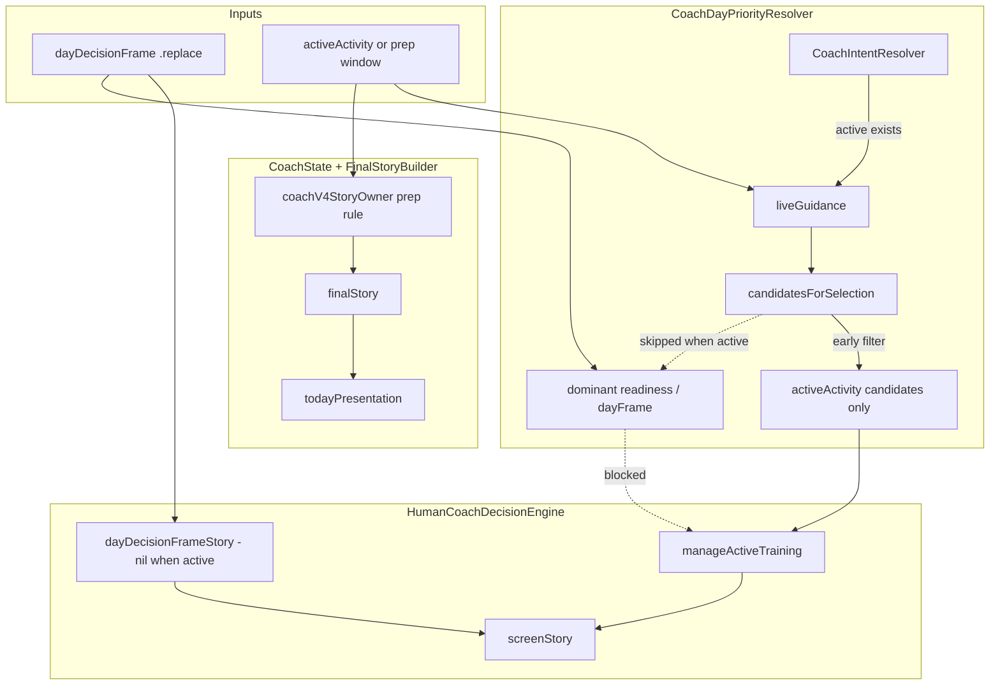

# Overload Masking Review

**Branch:** `cursor-recover-coachengine-folder-0826`  
**Commit baseline:** `60b8909` (prep-window hydration engine fix)  
**Scope:** Overload / plan-replacement masking only — no engine or test changes until this review is accepted.  
**Goal:** If overload/plan-replacement is the primary safety story, active/prep activity should not hide it.

---

## Executive summary

Overload safety is **split across two layers** today:

| Layer | Without active session | With active easy walk + future run |
|-------|------------------------|-------------------------------------|
| `dayDecisionFrame` | `.replace`, `accumulatedFatigue` | Same — frame is correct |
| `screenStory` (decision engine) | Replace / skip / cap copy | Replace frame exists; story uses `manageActiveTraining` + `activeSessionExecution` |
| `guidance.priority` | `planChallenge` / `trainingReadinessWarning` (expected) | **`activeSession` / `activeActivity`** (masked) |
| `todayPresentation` / `coachPresentation` | Prep-window copy hides replace | N/A for active-walk test; same prep masking when no active |

**Two distinct failure modes**, one shared root theme: **timed activity lifecycle (active/prep) wins over authoritative overload frame.**

---

## Failing tests (verified 2026-06-21)

| Test | Failing assertions | Passing assertions |
|------|-------------------|-------------------|
| `testActiveActivityCannotHideOverloadPlanReplacement` | `priority.priority` → `activeSession` not `planChallenge`; `priority.focus` → `activeActivity` not `trainingReadinessWarning` | `frame.planStatus == .replace`, `frame.primaryDriver == .accumulatedFatigue`, active phase, `activeSessionExecution` provenance |
| `testTodayPresentationUsesComposedFrameNarrative` | `todayPresentation.title` → `"The run is close now"` not `"Replace the run"`; `todayPresentation.message` → conservative prep open not overload read | `screenStory` still carries replace arc (test compares against it); overload risk tests pass |

**Passing overload siblings (same `overloadGuidanceWithFuture` helper):**

- `testOverloadDayCyclingSixtyMinutesReplacesOrCapsDuration`
- `testOverloadDayRunningSixtyMinutesSkipsOrMovesRun`
- `testOverloadDayRunningFifteenMinutesAllowsOnlyVeryEasyShortVersion`

These assert on `dayDecisionFrame`, `remainingActivityRisk`, and `screenStory` only — **not** `priority`, `todayPresentation`, or `coachPresentation`.

Phase 3 matrix (`CoachNarrativeMatrixValidationSuite`) has **no overload / plan-replacement scenarios**.

---

## Failure A — Active session masks priority (`testActiveActivityCannotHideOverloadPlanReplacement`)

### Scenario

- Active easy **Walk** (−10 min), completed Core + Strength, future **Running** (+45 min).
- Low recovery (44%), underfueled, high strain.
- `dayDecisionFrame.planStatus == .replace` ✓

### Observed vs expected

| Field | Actual | Expected (test) |
|-------|--------|-----------------|
| `priority.priority` | `activeSession` | `planChallenge` |
| `priority.focus` | `activeActivity` | `trainingReadinessWarning` |
| `phase` | `.active` | `.active` ✓ |
| `screenStory.primaryActions` | contains `activeSessionExecution` | ✓ |

### Code path (intentional live-session ownership)

1. **`CoachIntentResolver`** — any `activeActivity` → `.liveGuidance` (`CoachDayPriorityResolver.swift` ~3045).

2. **`candidatesForSelection`** — when intent is `.liveGuidance`, **first** filter returns only `focus == .activeActivity` candidates (~3440–3446). This runs **before** `isDominantTrainingReadinessWarning` and `isDominantDayDecisionFrameCandidate`, so plan-challenge candidates are removed from the pool when any active session exists.

3. **`resolve` DEBUG guard** — if active exists, selected focus must be `activeActivity` (~2988–2994).

4. **`HumanCoachDecisionEngine.resolve`** — `dayDecisionFrameStory()` only when `activeActivity == nil` (~2935–2945). Active walk uses `assess()` → `manageActiveTraining`.

5. **`storyPriority`** — `narrativePlan` with `executeActivity` objective maps to `.activeSession` / `.activeActivity` (~3254–3271).

6. **Comment contract** — `"Limiter=… shapes execution but cannot replace activeActivity."` (~6677).

### Classification

| Lens | Verdict |
|------|---------|
| **Implementation intent** | **Intentional** — live active session explicitly owns candidate selection, narrative path, and priority remapping. |
| **Safety test contract** | **Regression** — test requires overload to own `priority` while active phase + execution provenance remain visible. |
| **Product decision** | **Required** — choose between (a) current single-owner live model, or (b) dual contract: overload owns hero/priority, active owns phase/actions only. |

**Not a blind regression.** The engine encodes live-active supremacy on purpose. The test encodes a different safety contract that was never wired through the resolver when `activeActivity != nil`.

### Likely fix direction (after sign-off only)

- Let `isDominantDayDecisionFrameCandidate` / `isDominantTrainingReadinessWarning` compete **before** the liveGuidance active-only filter when `frame.shouldOwnNarrative && planStatus.requiresPlanChange` and active modality is easy recovery (walk).
- Or split contracts: keep `priority` on plan challenge while `phase` and `primaryActions` stay active-execution.
- Relax or replace the DEBUG assertion if dual ownership is accepted.

---

## Failure B — Prep window masks user-visible hero (`testTodayPresentationUsesComposedFrameNarrative`)

### Scenario

- `overloadGuidanceWithFuture(run)` — completed Core/Strength/Sauna, future Running (+45 min, 60 min), no active session.
- `dayDecisionFrame` and `screenStory` show replace/skip arc.
- `CoachState.ready` builds UI from `finalStory`, not `screenStory`.

### Observed vs expected

| Surface | Actual | Expected (from `screenStory` / frame) |
|---------|--------|--------------------------------------|
| `screenStory.title` | `"Replace the run"` | (reference) |
| `screenStory.myRead` | overload afternoon read | (reference) |
| `todayPresentation.title` | `"The run is close now"` | `"Replace the run"` |
| `todayPresentation.message` | `"Recovery is still limited today. Open conservatively and adjust by feel."` | overload `myRead` |

`coachPresentation` uses the same `finalStory` fields as `todayPresentation` (`CoachState.swift` ~402–416), so the hero card users see is prep-framed even when the decision frame says replace.

### Code path

1. **`dayDecisionFrame.shouldOwnNarrative`** — true when `planStatus.requiresPlanChange` (~839–841 `DayPriorityModel.swift`).

2. **`HumanCoachDecisionEngine`** — with no active session, `dayDecisionFrameStory()` produces correct replace `screenStory`.

3. **`CoachState.ready`** — `display` title/message can come from frame story (~358–362), but **`todayPresentation` and `coachPresentation` always use `finalStory.title/subtitle`** (~402–416), not frame-owned display copy.

4. **`CoachFinalStoryBuilder.coachV4StoryOwner`** — unconditional prep rule (~2096–2098):

   ```swift
   if sessionPhase == .pre, selectedIsSignificant {
       return .activityPreparation
   }
   ```

   This runs **before** readiness/recovery branches and **does not check** `guidance.dayDecisionFrame?.shouldOwnNarrative` or `planStatus == .replace`.

5. **`usesCoachV4DecisionFrame`** — always `true` (~1696–1700); V4 playbook hero replaces display fallbacks.

### Classification

| Lens | Verdict |
|------|---------|
| **Implementation intent** | **Accidental gap** — prep lifecycle rule predates authoritative frame ownership; no guard for `shouldOwnNarrative` + plan change. |
| **Safety / UX contract** | **Real regression** — user-visible hero understates plan replacement while decision frame and `screenStory` are correct. |
| **Test expectation** | **Valid** — `todayPresentation` should match composed frame narrative when frame owns the day story. |

**Not stale legacy expectation.** The test correctly catches a pipeline split: decision engine says replace; V4 final story says prep.

### Likely fix direction (after sign-off only)

- In `coachV4StoryOwner` (and/or `resolvedOwner`): when `dayDecisionFrame.shouldOwnNarrative && planStatus.requiresPlanChange`, skip `.activityPreparation` for prep-phase significant upcoming work; route to `.readiness` or a plan-challenge owner band.
- Optionally align `CoachState.todayPresentation` with frame-owned copy when `frameOwnsNarrative` (if product wants frame story on the hero card regardless of V4 owner).

---

## Cross-cutting diagnosis



**Pattern:** Timed activity context (live or prep) consistently outranks authoritative overload frame in **priority** (Failure A) and **user-visible hero** (Failure B). The frame layer itself remains correct.

---

## Product questions (must answer before logic changes)

1. **During an easy active recovery session on an overload day**, should the hero/priority stay live-active, or should plan replacement headline the coach card?

2. **When a significant session is in the prep window but the day frame says replace/skip**, should prep copy or replace copy own `todayPresentation` / `coachPresentation`?

3. **Is `screenStory` still the source of truth for safety messaging**, with `finalStory` as a lifecycle wrapper — or should they always match when `shouldOwnNarrative`?

---

## Recommended policy (draft)

| Context | `dayDecisionFrame` | `priority` / hero owner | Phase / actions |
|---------|-------------------|-------------------------|-----------------|
| Overload, no active, upcoming significant work in prep window | `.replace` / skip | **Plan challenge / readiness warning** — must not show prep-window hero | Prep support in secondary actions OK |
| Overload, easy active walk, hard work still ahead | `.replace` | **Product choice** — test wants plan challenge; engine wants active session | Active phase + execution provenance OK |
| Overload, no remaining risky work | `.complete` / recover | Recovery / complete-day owner | — |

---

## Next steps (after sign-off)

1. **Do not** update B–F test expectations for these two tests until product confirms policy.
2. If policy confirms overload must not hide:
   - Fix Failure B first (lower risk, no active-session conflict) — guard V4 prep owner against `shouldOwnNarrative`.
   - Fix Failure A second — resolver + optional dual-contract priority model.
3. Add Phase 3 matrix scenarios for overload + prep window and overload + active easy recovery so future refactors have a single contract source.

---

## Related reviews

- `OwnerCollapseReview.md` — rows for these two tests; refined here with code-path evidence.
- `BFClassification.md` — lists overload presentation under real regression group; unchanged.
